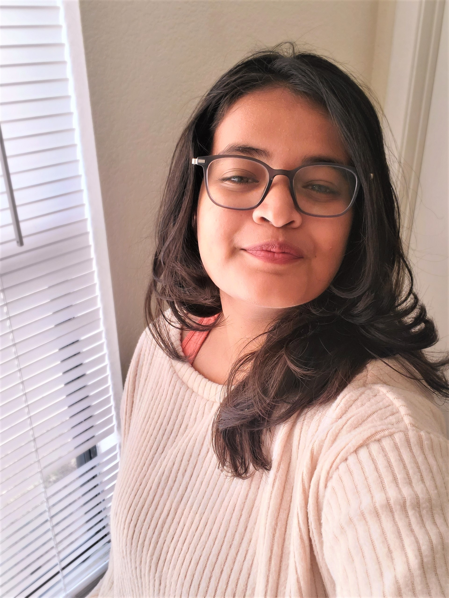
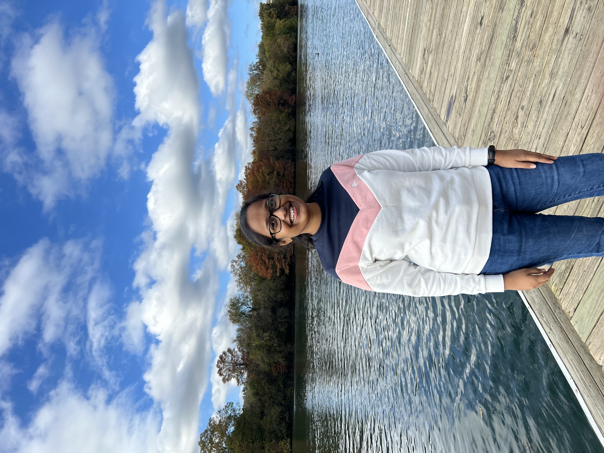

### Teaching Team 
-  Instructor: *Dr. Licia He* 
	- %20He_cropped.jpg)
	- Dr. Licia He is a generative artist and a human-computer interaction researcher. Her research lab, the Generative Craft Lab, is dedicated to the experimentations with digital art, traditional craft, and creative fabrication.

	
-  Teaching Assistant: *Rohith Kadivendi* (sections 500 & 502)
	-   
	- " I am Rohith Kadivendi, A computer science graduate student. I enjoy watching movies and playing sports. I am looking forward to getting to know you all."

-  Teaching Assistant:  *Shrimantee Roy* (section 501) 
	-  
	- "Howdy! I am Shrimantee Roy, Fall 2021 Grad student in Visualization at
College of Architecture. Having an undergrad degree in Computer Science
Engineering followed by adequate experience as a Software Development
Engineer and filled with immense passion for art, I dream to achieve the
perfect marriage of technical and artistic skills in the near future. I can
describe myself as patient, always thirsty for knowledge and truly believe I
will be able to learn so much while providing my best skills and hence
create an amazing learning environment this semester."

-   Teaching Assistant: *Harika Gumudavally* (section 503) 
	-   
	- "I am Harika Gumudavally, Master's student in Computer Science department. I have joined A&M in Fall 2021 semester and I am enjoying my stay here so far. I am from India and have 4 years of work experience. I love to dance and sketch in my free time. "

### Communication

The VIST 270 teaching staff is here to help you succeed. However, please follow these guidelines when you need help.  We will use a combination of Canvas, Email, and Piazza to faciliate communication. You are required to check your TAMU email and Canvas once a day. You are also required to read the syllabus throughoutly. The most up-to-date schedule is available at the course website. 

- Most course announcement will be done using Canvas. 

- If you have a non-grade related question about course material or assignment clarifications, please post on Piazza. You can sign-up at piazza.com/tamu/spring2022/vist270.  
	- Do not post partial or full answers to your homework on Piazza. 
	- The teaching team will monitor the piazza forum and try to get to your questions as soon as possible. However, please allow 24 hours for a response  (48 hours on weekends/breaks).

-  If you see any issue in your grades, please fill in a [grade change request form](https://forms.gle/KRE9pjkrtcNp1PwQ9) (https://forms.gle/KRE9pjkrtcNp1PwQ9) within 2 weeks after you receive the grade. We will try to get back to you as soon as we can (normally within 48 hrs).  
- If you have other questions you, please email the teaching team. 
-  All email to the instructors or TAs must come from your TAMU email address. Please allow 24 hours for a response to any email (48 hours on weekends/breaks). We will not correspond with your parents or guardians about your grades.

